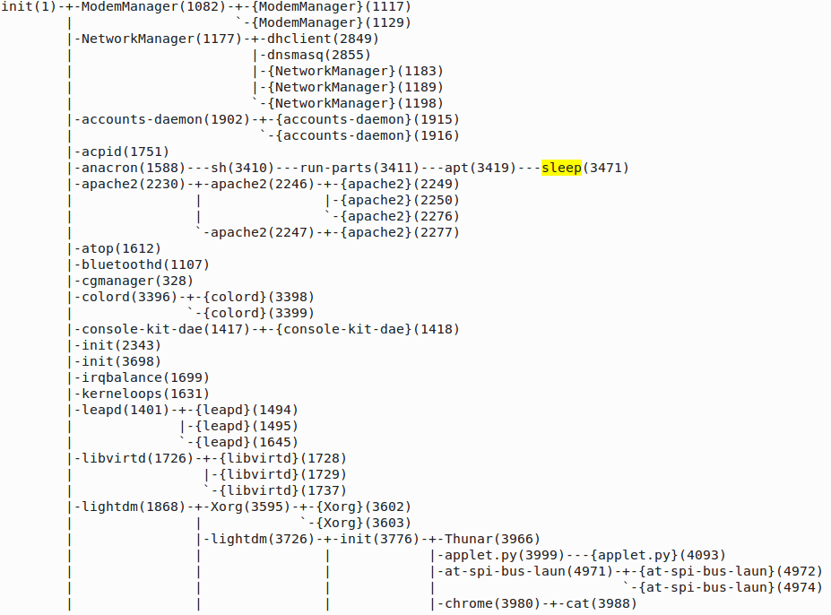

<span>[Часть 2.4](){: .label }</span>

Вы запустили следующую программу. Определите какое суммарное количество системных вызовов `read`, `write`
будет сделано в результате выполнения программы из консоли.

```c
#include <stdio.h>

int main()
{
  char name[100];
  printf("What is your name? __");
  gets(name);
  return printf("Hello %s\n", name);
}
```

```sh
$ strace -c ./main

% time     seconds  usecs/call     calls    errors syscall
------ ----------- ----------- --------- --------- ----------------
  0.00    0.000000           0         2           read
  0.00    0.000000           0         2           write
  0.00    0.000000           0         2           close
  0.00    0.000000           0         4           fstat
  0.00    0.000000           0         7           mmap
  0.00    0.000000           0         4           mprotect
  0.00    0.000000           0         1           munmap
  0.00    0.000000           0         3           brk
  0.00    0.000000           0         6           pread64
  0.00    0.000000           0         1         1 access
  0.00    0.000000           0         1           execve
  0.00    0.000000           0         2         1 arch_prctl
  0.00    0.000000           0         2           openat
------ ----------- ----------- --------- --------- ----------------
100.00    0.000000                    37         2 total
```

---

Ниже дан фрагмент дерева процессов Linux системы. Укажите имя каталога, файлы которого необходимо анализировать
для того чтобы получить сведения о процессе __sleep__. (Имя указывается без завершающего символа `/`)



Ответ: `/proc/3471`

---

Вы пишете программу, определяющую список родителей для некоторого процесса с идентификатором pid. Схематично
код основной функции приведен в следующем листинге.

```c
void print_process_parents(pid_t pid)
{
  pid_t current = pid;
  while (current != 1 ) 
  {
    printf("%d\n",current);
    current = get_parent_pid(current)
  }
  printf("%d (init) \n",current);
}
```

Что на ваш взгляд должна делать функция `get_parent_pid`? (Считая, что вместо _CURRENT_, используется реальной 
числовое значение _current_).

- [ ] Увеличить значение _CURRENT_ на единицу
- [ ] Прочитать из файла `/proc/CURRENT/status` значение параметра `Pid`
- [ ] Прочитать из файла `/proc/CURRENT/ppid` идентификатора родительского процесса
- [x] Прочитать из файла `/proc/CURRENT/status` значение параметра `PPid`

<span class="d-block text-right">
  [Часть 2.3]({{ site.baseurl }}){: .float-left }
  [Часть 2.5]({{ site.baseurl }})
</span>
